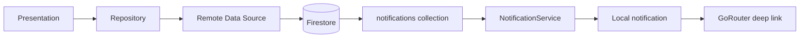

# Syncly

Firebase-based team messaging app (WhatsApp/Slack-lite) built with Flutter.  
MVP scope: workspace channels, text + image chat, roles, and in-app notifications.

## Stack

| Layer | Technology |
|-------|------------|
| UI | Flutter 3.x, Material 3 |
| State | Riverpod |
| Navigation | GoRouter |
| Auth | Firebase Auth (email/password) |
| Database | Cloud Firestore |
| Push | FCM tokens + Firestore notification inbox |
| Local alerts | flutter_local_notifications |

## Architecture

```
lib/
├── core/           # Router, theme, notifications, providers
├── features/
│   ├── auth/       # Login, register, roles (Host/Member)
│   ├── workspaces/ # Workspaces, channels, channel chat
│   ├── users/      # Profile
│   ├── settings/   # Theme, notifications toggle
│   └── chats/      # Legacy 1:1 chat (kept, not in main nav)
```

Feature modules follow **data → domain → presentation** clean architecture.



## Firebase collections

See `lib/features/workspaces/README.md` for workspace/channel schema.

| Collection | Purpose |
|------------|---------|
| `users/{uid}` | Profile, `fcmTokens` subcollection |
| `workspaces/{id}` | Team workspace + invite code |
| `workspaces/.../channels` | Text channels |
| `workspaces/.../messages` | Channel messages (base64 images) |
| `notifications` | In-app notification inbox |

Security rules: `firestore.rules`  
Indexes: `firestore.indexes.json`

## Setup

### Prerequisites

- Flutter SDK ^3.10
- Firebase project (`syncly-flutter`)
- Android Studio / Xcode for device builds

### Run locally

```bash
flutter pub get
flutter run
```

### Deploy Firestore rules

```bash
firebase deploy --only firestore:rules,firestore:indexes --project syncly-flutter
```

## MVP features (in scope)

- Email/password auth with Host/Member role at registration
- Create / join workspace via invite code
- Text channels with realtime messages
- Image messages (base64 in Firestore — no Firebase Storage)
- Typing indicators, read receipts, unread badges
- Channel notifications via Firestore inbox + local notification
- Offline-lite: Firestore persistence + cached data banner
- Profile and settings

## Out of scope (client proposal items not built)

- NestJS / custom backend API
- LiveKit voice/video calling
- Firebase Cloud Functions for server-side FCM fan-out
- Firebase Storage for media
- Isar / Hive local database
- Google Sign-In (hidden in UI)
- Friends/Users tabs (hidden from nav)
- Polls, comments, REST sync to `admin.syncly.com`

## Notifications

Channel messages create a `notifications` document for each recipient.  
`NotificationService` watches unseen notifications and shows a local alert.  
Tapping opens the channel via GoRouter (`type: channel_message`).

**Note:** Without Cloud Functions, notifications require the app process to be running (foreground or background). Fully killed apps won't receive alerts until reopened.

## Offline behavior

Firestore persistence is enabled on mobile with unlimited cache.  
When the device is offline, the app shows cached workspaces/channels/messages and an orange offline banner.

## Demo

See [DEMO.md](DEMO.md) for step-by-step Host/Member walkthrough.

## Sprint history

| Sprint | Focus | Status |
|--------|-------|--------|
| 1 | Auth roles, cleanup | Done |
| 2 | Workspaces + channels | Done |
| 3 | Channel text chat | Done |
| 4 | Notifications polish, offline, docs, legacy cleanup | Done |
